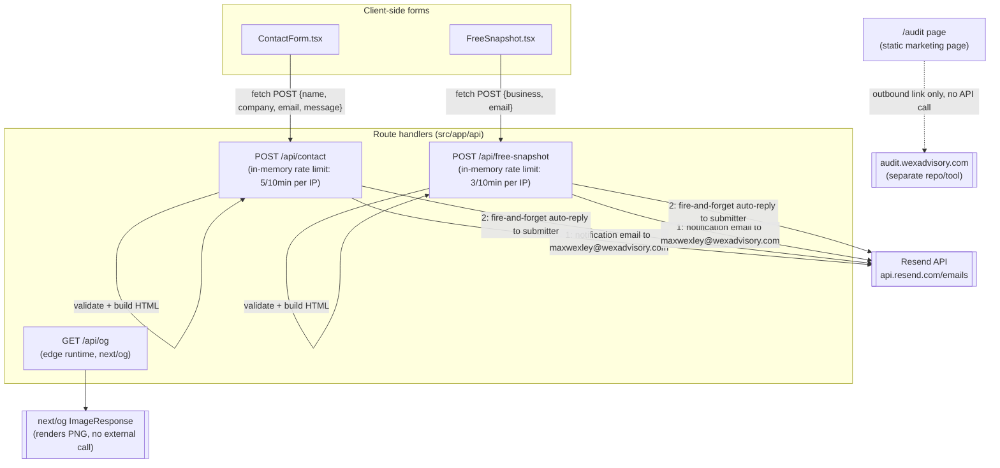

# Backend Architecture — wex-advisory (wexadvisory.com)

Generated by /architecture-map on 2026-08-18 — traced from code, not docs.

This is the marketing/consulting site for Wex Advisory. It is almost entirely static
marketing pages (`src/app/*/page.tsx`). The only real backend surface is 3 Next.js
route handlers under `src/app/api/`. There is **no `lib/` directory**, no cron config
(`vercel.json` does not exist in this repo), and no trigger.dev tasks — every route is
self-contained with its logic inline in `route.ts`.

## What's deliberately left out
- Page-level static routes (`/`, `/work`, `/privacy`, `/terms`, `/ai-*-for-small-businesses`) — no backend calls, pure marketing content.
- `scripts/generate-sample-report.js` and `scripts/redact-sample-report.js` — build-time/local scripts, not part of the runtime request path.

## Mismatches / notes found
- The `/audit` page markets "Free AI Opportunity Audit" but all it does is link out to `https://audit.wexadvisory.com/audit` — a separate, unrelated repo/tool (the actual AI Audit product). No audit logic lives in this codebase.
- No `vercel.json`, no cron jobs, no scheduled entry points exist in this repo — everything fires on-demand from a user request.
- Both mail-sending routes duplicate the same rate-limit + Resend-call pattern inline rather than sharing a `lib/` helper — there is no shared library code to trace a second hop into.
